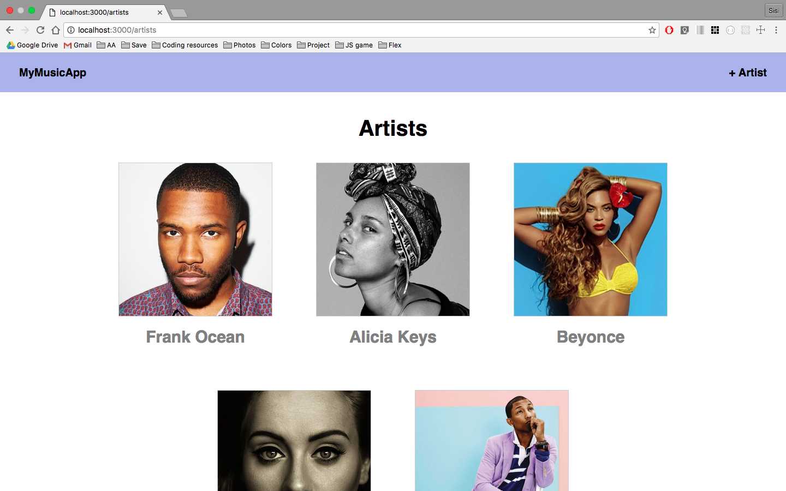
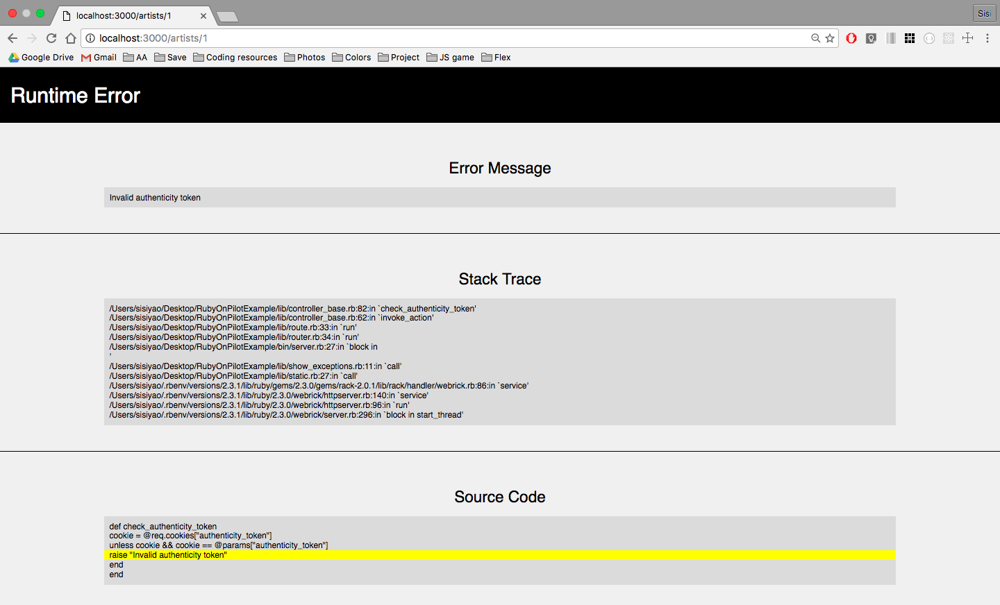

# Ruby on Pilot

## Overview

Ruby on Pilot is a lightweight MVC framework inspired by the functionality of Ruby on Rails and built using metaprogramming techniques. The features in this framework include:
* An ORM inspired by `ActiveRecord`
* `Controller::Base` with basic functionality similar to `ActionController::Base`
* Routes and router
* Ability to implement `session`, `flash`, and `flash.now` cookies
* CSRF protection with a form authenticity token
* Rack middleware to show runtime errors
* Rack middleware to serve up static css assets

Framework dependencies:
* `ActiveSupport::Inflector` library
* `Rack` module


## Example App

Here is an example app I built on top of this framework. [Link to the Github is here](https://github.com/sisiyao/RubyOnPilotExample).




## Basic Setup

* Clone the repository.
* Install gems with `bundle install`.
* Set up a sql file in the `config` folder. The framework currently uses SQLite3 so users must set up the database structure in a sql file. Users can rename `config/sql_file.sql` and `config/db_file.db` as long as they update the `config/db_settings.rb` file.
* Run a local server with `ruby bin/server.rb` on `localhost:3000`.


## Features & Usage

### `ModelBase and Associations`

`ModelBase` and `Associations` construct an object relational mapping that allows user to interact with the database. Code lives in `lib/model_base.rb`, `lib/assoc_options.rb`, `lib/assoc_options_belongsto.rb`, and `lib/assoc_options_hasmany.rb`.

To create a model, add a file under `app/models` and use the following starting code to inherit `ModelBase` functionality:

  ```Ruby
  require_relative '../../lib/model_base'

  class User < ModelBase
    finalize!
  end
  ```
The database interface includes the following methods:
* all
* find
* where
* update
* save
* destroy

You can also add association methods in your models with these methods:
* belongs_to
* has_many
* has_one_through
* has_many_through

### `ControllerBase`

Ruby on Pilot uses a `ControllerBase` class to provide functionality similar to `ActionController::Base` in Rails. `ControllerBase` will do the groundwork of rendering content from views with data pulled from the model class, while preventing double rendering of views. View the source code in `lib/controller_base.rb`.

To create a controller, add a file under `app/controllers` and use the following code to inherit from `ControllerBase`:

  ```Ruby
  require_relative '../../lib/controller_base'
  #make sure to require relevant model files

  class UsersController < ControllerBase
  end
  ```

Methods available for use controller classes include:
* redirect_to
* render

### `Views`

Users should create view under `lib/views/`. Views must be organized into controller class folders. For example:
- app (folder)
  - views (folder)
    - users_controller (folder)
      - index.html.erb
      - new.html.erb
    - posts_controller (folder)
      - edit.html.erb
      - show.html.erb


### `Router & Routes`

Upon starting the server, the framework will instantiate a Router object that is responsible for creating Routes. When an HTTP request comes in, the Router will match the reqest to the correct Route, instantiate the Controller associated with that, and tell the Controller to invoke the correct action.

Users must create routes in the `bin/server.rb` file under:
```Ruby
  router.draw do
    # list routes
  end
```

Routes are initialized with a regex pattern to match the request route, an HTTP method, the controller class, and the controller action. Here is an example of routes following RESTful api standard:
```Ruby
  router.draw do
    get Regexp.new("^/users$"), UsersController, :index
    get Regexp.new("^/users/(?<id>\\d+)$"), UsersController, :show
    get Regexp.new("^/users/new$"), UsersController, :new
    post Regexp.new("^/users$"), UsersController, :create
    get Regexp.new("^/users/(?<id>\\d+)/edit$"), UsersController, :edit
    patch Regexp.new("^/users/(?<id>\\d+)$"), UsersController, :update
    delete Regexp.new("^/users/(?<id>\\d+)$"), UsersController, :destroy
  end
```

Ruby on Pilot supports GET, POST, PATCH, and DELETE HTTP methods. View the source code for routing functionality under `lib/router.rb` and `lib/route.rb`.


### `Session & Flash`

`Session`, `Flash`, and `Flash.now` methods are provided in the `ControllerBase` class as ways to store data in cookies. View the source code in `lib/session.rb` and `lib/flash.rb`.

* `Session`: Reads and passes the session token via a cookie in every request / response cycle.
* `Flash`: Passes data via a flash cookie that persists for one cycle only.
* `Flash.now`: Stores data that is available in the current cycle only and does not persist to future cycles.

Example of `flash.now` used for displaying error messages:
```Ruby
  def create
    @user = User.new(params["user"])
    if @user.save
      redirect_to "/"
    else
      flash.now[:errors] = @user.errors
      render :new
    end
  end
```


### `CSRF Protection`

CSRF protection is also available via the `::protect_from_forgery` and `#form_authenticity_token` methods in `ControllerBase`.

To use built in CSRF protection in this framework, add the `::protect_from_forgery` method to your controller classes and the `#form_authenticity_token` in your html forms. For example:
```Ruby
  class ArtistsController < ControllerBase
    protect_from_forgery
  end
```
```html
  <div class="form">
    <form action="/users/<%= @user.id %>" method="POST">
      <input type="hidden" name="authenticity_token" value="<%= form_authenticity_token %>">
    </form>
  </div>
```


### `Runtime error handling`

Rack middleware will catch and display runtime errors with the error message, a stacktrace, and a preview of the error's source code. Currently functionality of this middleware does work with errors caught in `.erb` files.



View the source code for this middleware under `lib/show_exceptions.rb`.


### `Static CSS Assets`

The Ruby on Pilot framework will serve up css stylesheets with a Rack middleware for static assets. To use this feature, create your css files under `app/stylesheets/` and link the relevant stylesheets in your html view files using like so:
```html
  <head>
    <link rel="stylesheet" href="/stylesheets/reset.css" type="text/css">
  </head>
```

View the source code for this middleware under `lib/static.rb`.


## Future Improvements

Plans for additional features include:
* Integration with PostgreSQL. Currently, functionality only works with SQLite3
* Implement a Relations class that allows method chaining and lazy evaluation for ORM methods
* Implement a 'pilot new' command similar to 'rails new'
* Turn framework into a Ruby gem
